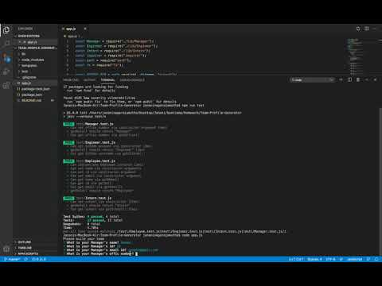
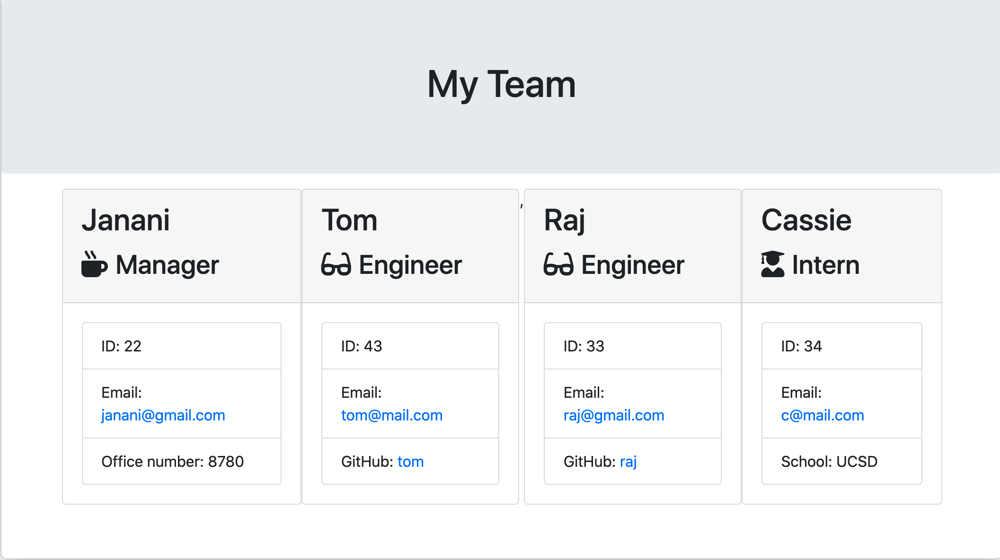

# Team-Profile-Generator

## Table of Contents

* [Description](#description)
* [Installation](#installation)
* [ApplicationDemo](#demo)
* [Screenshots](#screenshots)

## Description 

This repository consists of code that generates a team profile in html format.

The application collects team members' details through command line interface, which is implemented using npm inquirer. Once the data is collected, the html content is framed and written into output/team.html file using node's file system package. The application was developed using test driven approach, the test cases are tested using "JEST" API. OOPs concept of inheritance is used to create relationship between each objects.

Git is used for version controlling and for periodic commits to Gitlab.

## Installation

Execute ``` npm install ``` command in terminal(Mac) or command promt(windows) to install all needed packages to run this application successfully.

Run ``` npm run test ``` command in terminal(Mac) or command promt(windows) to test the test cases.

Run ``` node app.js ``` command in terminal(Mac) or command promt(windows) to start the application.


## Demo

[](http://www.youtube.com/watch?v=KCNszPv0rws "Demo")

## Screenshots
<br>